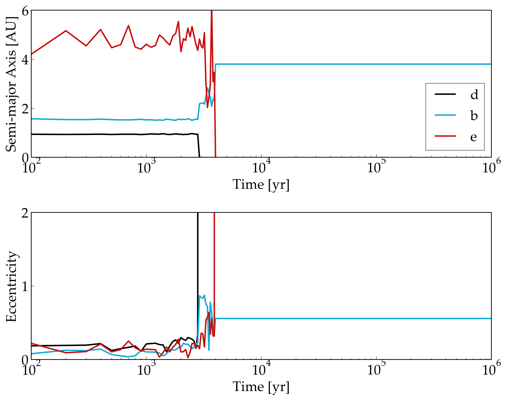
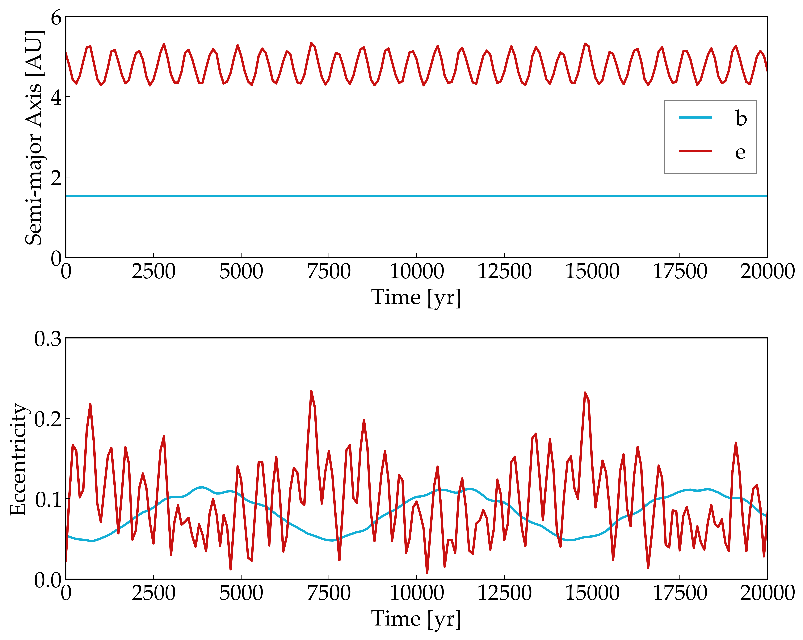

N-Body Dynamics of the Mu Arae Planetary System
============

Overview
--------

Orbital evolution of the Mu Arae planets with the orbital elements found in
Benedict, G.F. et al. (2020).

===================   ============
**Date**              05/26/2019
**Author**            Rory Barnes
**Modules**           SpiNBody
**Approx. runtime**    hr
===================   ============

To run this example
-------------------

.. code-block:: bash

  cd be; vplanet vpl.in
  cd ../bde; vplanet vpl.in
  python makeplot.py <pdf | png>

Expected output
---------------

Fig. 1: Orbital evolution of Mu Arae d (black), b (blue), and e (red), with
semi-major axis on top and eccentricity below. The system goes unstable after
3,000 years

Fig. 2: Orbital evolution of the Mu Arae system, but without planet d. Without
this planet this system shows regular motion and is likely stable for Gyr
timescales.
